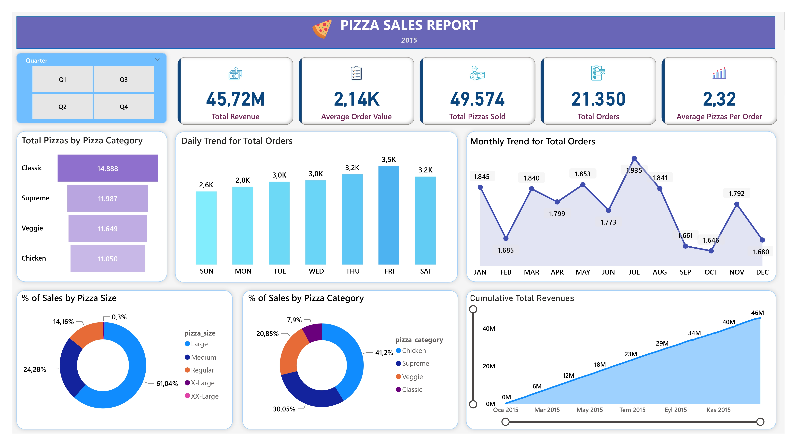
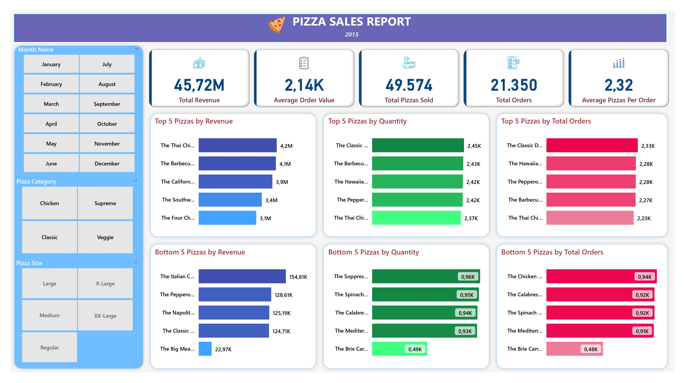

# Pizza Sales Analysis

 
 

## Problem Statement

​The sales management of Delicious Pizzas Company needs a better understanding of pizza sales performance and how to improve their pizza sales. Therefore, the Sales Manager is requesting faster access to real-time data, more effective tracking of sales trends, and improved data comprehension. To meet these demands and better guide business strategies, the requirement requested by the company are as follows:

---

**KPI'S REQUIREMENT**
 

1. Total Revenue
2. Average Order Value
3. Total Pizzas Sold
4. Total Orders
5. Average Pizzas per Order

---

**CHARTS REQUIREMENT**
 

1. Daily Trend for Total Orders
2. Monthly Trend for Total Orders
3. Percentage of Sales by Pizza Category
4. Cumulative Total Revenues by Date
5. Percentage of Sales by Pizza Size
6. Top 5 Best-Selling Pizzas by Revenue, Total Quantity and Total Orders
7. Bottom 5 Best-Selling Pizzas by Revenue, Total Quantity and Total Orders

 

## Skills & Features Demonstrated in MSSQL and Power BI:

- MSSQL Quaries

- Power Query

- Calculated Column

- Conditional Column

- Filters

- Slicers

- DAX Functions: 

     * DIVIDE()

     * CALCULATE()

     * FILTER()

     * ALLSELECTED()

     * DISTINCTCOUNT()

     * SUM()

     * MAX()

     * SWITCH()

 

## Data Exploration

In the data analysis phase, to extract meaningful insights from the dataset is crucial for exploring and understanding dataset. SQL queries were created in MSSQL based on requirements that sales management team demanded. All SQL quaries are as follow: 
 
 

- TOTAL REVENUE

SELECT SUM(pizza_sales.total_price) AS Total_Revenue
FROM pizza_sales
 
 

- AVERAGE ORDER VALUE

SELECT ROUND(SUM(total_price) / COUNT(DISTINCT order_id),2) AS Avg_Order_Value
FROM pizza_sales
 
 

- TOTAL PIZZA SOLD

SELECT SUM(quantity) AS Total_Pizza_Sold
FROM pizza_sales
 
 

- TOTAL ORDERS

SELECT COUNT(DISTINCT order_id) AS Total_Orders
FROM pizza_sales
 
 

- AVERAGE PIZZA PER ORDER

SELECT CAST(CAST(SUM(quantity) AS DECIMAL(10,2)) /
CAST(COUNT(DISTINCT order_id) AS DECIMAL(10,2)) AS DECIMAL(10,2)) AS Avg_Pizzas_Per_Order
FROM pizza_sales
 
 

- DAILY TREND FOR TOTAL ORDERS

SELECT DATENAME(DW, order_date) AS order_day, COUNT(DISTINCT order_id) AS Total_Orders
FROM pizza_sales
GROUP BY DATENAME(DW, order_date)
 
 

- MONTHLY TREND FOR TOTAL ORDERS

SELECT DATENAME(MONTH, order_date) AS Month_Name,
COUNT(DISTINCT order_id) AS Total_Orders
FROM pizza_sales
GROUP BY DATENAME(MONTH, order_date)
ORDER BY Total_Orders DESC
 
 

- PERCENTAGE OF SALES BY PIZZA CATEGORY

SELECT pizza_category, SUM(total_price) AS Total_Sales, CONCAT( '% ', ROUND(SUM(total_price) * 100 /
(SELECT SUM(total_price) FROM pizza_sales),2)) AS PCT_of_Sales
FROM pizza_sales
GROUP BY pizza_category
 
 

- PERCENTAGE OF SALES BY PIZZA SIZE

SELECT pizza_size, SUM(total_price) AS Total_Sales, CONCAT( '% ', ROUND(SUM(total_price) * 100 /
(SELECT SUM(total_price) FROM pizza_sales),2)) AS PCT_of_Sales
FROM pizza_sales
GROUP BY pizza_size
 
 

- TOTAL PIZZAS SOLD BY CATEGORY

SELECT pizza_category, SUM(quantity) AS Total_Quantity_Sold
FROM pizza_sales
GROUP BY pizza_category
ORDER BY Total_Quantity_Sold DESC
 
 

- TOP 5 BEST-SELLING PIZZAS BY REVENUE

SELECT TOP 5 pizza_name, SUM(total_price) AS Total_Revenue
FROM pizza_sales
GROUP BY pizza_name
ORDER BY Total_Revenue DESC
 
 

- BOTTOM 5 BEST-SELLING PIZZAS BY REVENUE

SELECT TOP 5 pizza_name, SUM(total_price) AS Total_Revenue
FROM pizza_sales
GROUP BY pizza_name
ORDER BY Total_Revenue ASC
 
 

- TOP 5 BEST-SELLING PIZZAS BY QUANTITY

SELECT TOP 5 pizza_name, SUM(quantity) AS Total_Pizza_Sold
FROM pizza_sales
GROUP BY pizza_name
ORDER BY Total_Pizza_Sold DESC
 
 

- BOTTOM 5 BEST-SELLING PIZZAS BY QUANTITY

SELECT TOP 5 pizza_name, SUM(quantity) AS Total_Pizza_Sold
FROM pizza_sales
GROUP BY pizza_name
ORDER BY Total_Pizza_Sold ASC
 
 

- TOP 5 BEST-SELLING PIZZAS BY TOTAL ORDERS

SELECT TOP 5 pizza_name, COUNT(DISTINCT order_id) AS Total_Orders
FROM pizza_sales
GROUP BY pizza_name
ORDER BY Total_Orders DESC
 
 

- BOTTOM 5 BEST-SELLING PIZZAS BY TOTAL ORDERS

SELECT TOP 5 pizza_name, COUNT(DISTINCT order_id) AS Total_Orders
FROM pizza_sales
GROUP BY pizza_name
ORDER BY Total_Orders ASC
 
 

## Data Transforming & Cleaning

​After executing SQL queries, the data was transferred to Power BI. Before creating the dashboard, there is a data transforming and cleaning process. The data transforming and cleaning transactions are as follows:
​ 
- In the 'pizza_size' column, values 'S', 'M', 'L', 'XL', 'XXL' have been replaced with 'Regular', 'Medium', 'Large', 'X-Large', 'XX-Large' .
- The day of the week has been extracted from the 'order_date' column and added as a new column.
- The abbreviated version of the days of the week has been added as a new column using the following formula:
  - Order Day = UPPER(LEFT(pizza_sales[Day Name],3))
- The 'day_number' column has been added using the conditional column feature.
- The 'month_name' and 'month_number' columns have been added using the date feature.
- The abbreviated version of the 'month_name' column has been added as a new column using the following formula:
  - Order Month = UPPER(LEFT(pizza_sales[Month Name],3)) ​
- The new column 'Quarter' has been added using the following formula:
  
  - Quarter =
       SWITCH(TRUE(),
      
          pizza_sales[Month Number] = 1, "Q1",
      
          pizza_sales[Month Number] = 2, "Q1",
      
          pizza_sales[Month Number] = 3, "Q1",
      
          pizza_sales[Month Number] = 4, "Q2",
      
          pizza_sales[Month Number] = 5, "Q2",
      
          pizza_sales[Month Number] = 6, "Q2",
      
          pizza_sales[Month Number] = 7, "Q3",
      
          pizza_sales[Month Number] = 8, "Q3",
      
          pizza_sales[Month Number] = 9, "Q3",
      
          pizza_sales[Month Number] = 10, "Q4",
      
          pizza_sales[Month Number] = 11, "Q4",
      
          pizza_sales[Month Number] = 12, "Q4",
      
          BLANK())
  
 
## Measures Created
The next step is to visualize the data, making it more comprehensible and facilitating clear interpretations. Power BI is the one of the best visualization tools in the world for the data analysis process. In this is project, Power BI was used for data visualization. Before starting to create dashboard, measures were created to enhance the formation of charts and cards for visualization. Measures for this project are as follow: 
  

 
- Average Order Value = DIVIDE([Total Revenue],[Total Orders],0)
 

- Average Pizzas Per Order = DIVIDE([Total Pizzas Sold],[Total Orders])
 

- Cumulative Totals = 
CALCULATE(
    [Total Revenue],
    FILTER(ALLSELECTED(pizza_sales[order_date]),
    pizza_sales[order_date] <= MAX(pizza_sales[order_date])
    )
)
 

- Total Orders = DISTINCTCOUNT(pizza_sales[order_id])
 

- Total Pizzas Sold = SUM(pizza_sales[quantity])
 

- Total Revenue = SUM(pizza_sales[total_price])

 

## Data Modelling
No modeling was necessary as we only needed a table for analysis.

 

## Analysis & Visualization
After the creation of the measures, the dashboard was compeleted. First page of the dashboard shows the total orders and sales figures in various category. Second page of the dashboard shows top 5 and bottom 5 best-selling pizzas by different category.
 
 

[Click here to open the dashboard and try it out yourself!](https://app.powerbi.com/view?r=eyJrIjoiNjQ2MjM3NGEtNjFmOC00NDk4LTk0YzgtNmU3ZGZkNjRkNmQxIiwidCI6IjQwM2RmZTQxLWU5NmMtNDkwYy05NTZmLWY0NzZjMGI5MDA1OSIsImMiOjl9)

 
 

The insights obtained from the dashboard are as follows:
 
​
1. The best-selling pizza category is **Classic** with nearly 15k units sold.

2. The day when the majority of pizzas are ordered is **Friday**.

3. Total orders peaked in **July**.

4. 61% of the people who bought pizza chose the **large-size** pizza.

5. Just 0,3% of the people who bought pizza prefer the **X-Large-size** pizza.

6. **Chicken** pizzas contribute the most to overall revenue with 41% ratio.​

7. The average order value is 2,14k.

8. Nearly 50k units of pizza sold in total.

9. 2,32 pizzas sold per order.

10. **The Classic Deluxe Pizza** is the most ordered pizza while **The Brie Carre Pizza** is the least ordered pizza in general.

11. **The Thai Chicken Pizza** contribute the most to revenue while **The Big Meat Pizza** contribute the least in general.
 

## Conclusions & Recommendations
* The continuous increase in cumulative sales over time is positive for the company in terms of ensuring the sustainability of sales.

* The observation that the highest number of pizza orders occurs on Fridays may be attributed to people seeking to treat themselves to a nica meal on the last working day of the week.

* The X-Large and XX-Large size pizzas have the lowest sales. Focusing on the sales of these sizes of pizzas may contribute to the total sales more significantly.
 

 

This documentation has been prepared to help you understand the project effectively. If you have any questions or feedback, please don't hesitate to let me know.
Thank you for your time and consideration!
 

Reference: https://www.youtube.com/watch?v=V-s8c6jMRN0&list=WL&index=11&t=775s

 
 

